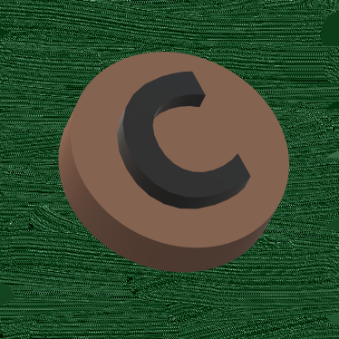

# Checkers
### Website URL: https://gameofcheckers.000webhostapp.com

> The team consists of Travis Union, Tory Lauren, Kaitlyn West, and Tyler Gates.

> Viewers of our website create their own account to play checkers against themselves or with someone on the same computer.

> Our goal is to create an online website to host games of checkers offline, online, or versus bots!
  We are doing it for any checkers enthusiasts or beginners who want to pick up a hobby to play on the go!
  We hope to make checkers even more accessible and easier to play.

## Table of contents
* [General info](#general-info)
* [Technologies](#technologies)
* [Features](#features)
* [Future Features](#future-features)
* [Team Member Work](#team-member-work)

## General info

## Technologies
* Javascript - version ECMAScript 2020
* HTML - version 5.2
* CSS - version 2.1
* SQL - version 2016
* PHP - version 7.3

## Features
* Login / Register System (Client-Server Side)

        Allows users to login to their own accounts or register for an account.

* Ability to play game of checkers

        Create the board and pieces using HTML and CSS
        The functionallity of the checker game comes from JavaScript

* Option Menu

        Future feature that will be used when establishing multiplayer games.

## Future Features (Future Sprints)
* Online Multi-player.

        Real-time online multiplayer for play with friends.
        Creates a convenience for friends to play remotely while not in the
        same room.

* Profiles.

        Each user can create their own profile and customize it.
        Customization for players to show off their checkers achievements
        and skills.

* Animate.

        Checker Capture Animations when a user captures an opponents checker(s).
        Interactability while playing the game. Players can pick and choose
        which animation type they want prior to starting a game.

## Team Member Work

### Kaitlyn West
* Finished:

         * I designed the look of the login (index.html) and register page
           (newAccount.html) of the website using HTML and CSS. After doing
           so, I was able to link a database using HTML, PHP, and MySQL
           (connect.php). This is so our viewers have their own
           accounts to play checkers (loginProcess.php). Lastly,
           the code was linked to a server for all who have a browser.
         * For sprint 2, I was able to re-design the look of the login/register 
           pages (index.php and newAccount.php). There were error messages added for 
           the user to be aware there was a problem with either registering or logging
           in. There was also a confirm button added to the newAccount.php page for the user.
           Next, there were minor bugs to be fixed such as a user could go to the
           HomePage.php without logging in. It has been changed though. 
         * For sprint 3, I was able to re-design the error messages to where 
           they are more flashy and eye catching (created from paint). There 
           is also an error message on the register page(newAccount.php) where 
           the user is notified if password/confirm password don't match or
           email already exists in database.
         * Also, for sprint 3, I was able to create a start for the profile pages. The 
           user is able to input name/nickname, hobbies, and checkers ability on a scale
           (1 - 10 (being best)). The information is saved, but until the user logouts. 
         * Research was done both on real time online multiplayer and AI. Online mutpliayer 
           proved impossible due to time constraints. We would have had changed web hosting 
           apps completely due to the one we are using not being able to install Node.js. 
           Notes are should in the research folder of the src folder. 
         

* Next Step:

        * Research and getting used to new platform where Node.js can be installed. 
        * Add multiplayer functionality to website / implement code.
        * Fix up profile page. Ability to save profile page information.

### Travis Union
* Feature's Accomplished:

      1. For sprint 2, I created a timer so that each player has 2 minutes to make a move. The timer function was placed in /src/game/Checker.html. I also created a more dramatic visual for a player win, with a button that will link back to the game if the user wants to play again. These functions are located in /src/UIsourceFiles.

* Status:

      1. Status for the project is in good-standing according to sprint two.
      2. Full functionality will be implemented in sprint three.

* Next Step:

      1. Fix the timer so that it resets immediately after a player makes a move
      2. Link the new player win functions to the local host
      3. Fully implement a win counter

### Tyler Gates
* Finished:

        * I created functionality for interaction with the checkerboard interface,
          as well as the interface itself. The checkerboard, clickable pieces, moving pieces,
          taking pieces, turn indicator at the bottom, etc.
        * For sprint 2, I was able to fix the GUI bug for the black pieces, add a piece
          taken counter for each side, and add the functionality for multijump turns if the
          pieces align.
        * For Sprint 3, I change the pieces from colors to images, and the checkerboard to 
          actual wood. While also fixing a critical bug in the multijump function
